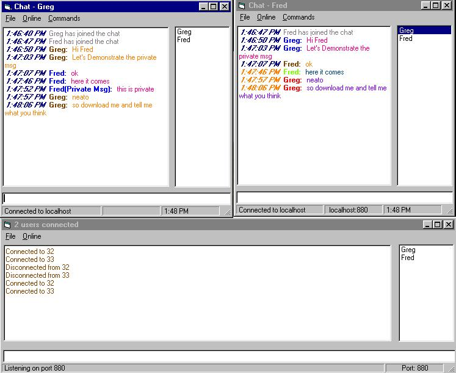



## Multi Connection Chat

### Description

This is a multi connection chat using winsock. It supports multi-user, coloured chat windows, private messages, and will even display all the tasks running on another clients PC (but you'll have to look in the code for the command =). Each client displays the entry and exit of other clients, as well as maintaining a listbox of current users. Also included is a mIRC like entry box where you can use the up and down arrows to access recent commands. Please leave any suggestions. This is my first post here and a work in progress. Any suggestions will be appreciated.
 
### More Info
 

             |
---                |---
**Submitted On**   |2000-06-23 13:48:16
**By**             |[VB Man](https://github.com/Planet-Source-Code/PSCIndex/blob/master/ByAuthor/vb-man.md)
**Level**          |Beginner
**User Rating**    |4.8 (19 globes from 4 users)
**Compatibility**  |VB 5\.0, VB 6\.0
**Category**       |[Complete Applications](https://github.com/Planet-Source-Code/PSCIndex/blob/master/ByCategory/complete-applications__1-27.md)
**World**          |[Visual Basic](https://github.com/Planet-Source-Code/PSCIndex/blob/master/ByWorld/visual-basic.md)
**Archive File**   |[CODE\_UPLOAD70356232000\.zip](https://github.com/Planet-Source-Code/vb-man-multi-connection-chat__1-9166/archive/master.zip)

